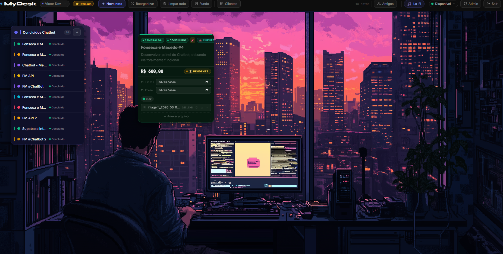
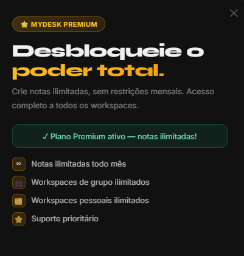
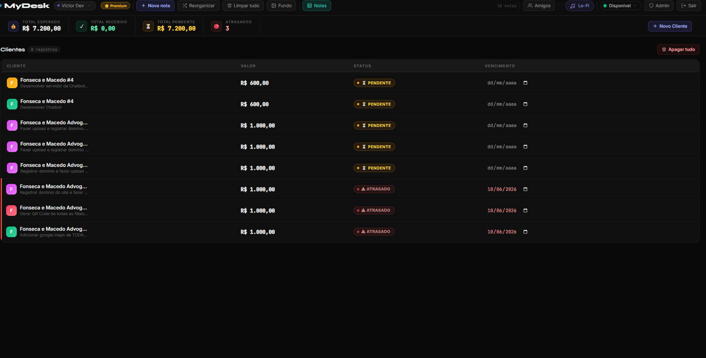

<div align="center">


# MyDesk-Colab

**Cópia isolada para colaboração e desenvolvimento do MyDesk.**

[](https://github.com/jvalvim-bit/mydesk-collab)
[](https://github.com/jvalvim-bit/mydesk-collab/tree/mateus-dev)
[](https://firebase.google.com)

[**Abrir repositório →**](https://github.com/jvalvim-bit/mydesk-collab) &nbsp;·&nbsp; [Trabalhar na `mateus-dev`](https://github.com/jvalvim-bit/mydesk-collab/tree/mateus-dev)

</div>

---

> [!IMPORTANT]
> Esta cópia não é o ambiente de produção. Use somente projetos, domínios e
> credenciais de desenvolvimento próprios. A configuração conhecida do MyDesk
> de produção é bloqueada pelo código. Não publique, não aponte serviços e não
> copie credenciais do projeto original para este repositório.
>
> A `main` é a referência estável. O trabalho de colaboração deve acontecer na
> `mateus-dev`, com Pull Request para `main` quando estiver revisado.

## Overview

> **Workspace separation is a product invariant, not an implementation detail.**
> Each board's notes belong to that board; shared boards (1:1 and group) sync
> among their own participants; and **no workspace ever pulls, copies or pastes
> from the personal board**. The rules, where each one is enforced in the code
> and which sweep guards it are in **[REGRAS-WORKSPACE.md](REGRAS-WORKSPACE.md)**
> — read it before touching the sync core.


**MyDesk** is a collaborative notes workspace with a dark visual style and a focus on productivity. Unlike traditional note-taking apps, MyDesk combines the following into a single interactive visual board:

- **Freely positionable notes** with drag-and-drop, resizing, and automatic stacking
- **Financial CRM** built into notes for client management
- **Real-time chat** 1:1 and in groups, plus **group video calls** (WebRTC)
- **Shared workspaces** synced live with friends
- **Plan system** with recurring subscriptions (Stripe Billing)

Built entirely with HTML, CSS, and vanilla JavaScript — no frameworks — using Firebase as the real-time backend.

### Brazilian data integrations

The CRM and public form builder include optional smart fields that require no API key:

- **ViaCEP**, with **BrasilAPI** fallback, for address lookup by CEP
- **BrasilAPI** for public company lookup by CNPJ
- **IBGE Localidades** for the official state and municipality lists

Requests use the `/api/form` endpoint configured for the environment local or
de desenvolvimento, are validated and normalized before reaching the browser,
and use CDN plus local caching. See [docs/INTEGRACOES_BRASIL.md](docs/INTEGRACOES_BRASIL.md).

---

## Screenshots

### Landing Page 


*Animated typewriter with demo notes in the background, login via email/password or Google OAuth*

---

### Main Board — Notes & Workspace


*Board with note stacks, custom wallpaper, and a client note (CRM) open with value and attachment*

---

### Premium Plan



*Upgrade modal with Premium plan benefits (unlimited notes, group workspaces, CRM)*

---

### Financial CRM *(Premium)*


*Dashboard with totals for expected, received, and pending revenue, plus overdue clients*

---

## Features

### Notes System (Core)

The board is an infinite canvas where notes are positionable cards with:

| Feature | Detail |
|---|---|
| **19 color palettes** | Each color coordinates the bar, chip, dot, and card background |
| **4 progress statuses** | To Do · In Progress · Done · Closed |
| **Dates and reminders** | Start, due date, and automatic alert (1-365 days ahead) |
| **Resizing** | Drag the bottom-right corner to adjust size (both directions) |
| **Drag-and-drop** | Move notes freely around the board |
| **Attachments** | PDF, images, TXT — viewed inside the note |
| **Checklists** | Checkable to-do items per note, with a progress badge |
| **Stacks** | Drag one note onto another to stack automatically |
| **Pin** | Pin important notes so they don't collapse into stacks |

**Visual statuses:**
- 🔵 **To Do** — slate dot, no animation
- 🟣 **In Progress** — pulsing indigo dot + sound
- 🟢 **Done** — emerald dot + success sound
- 🔴 **Closed** — red dot

**Free plan limit:** 30 notes/month (resets on the 1st of each month).

---

### Stacking System

Group related notes into compact stacks:

1. Drag a note and drop it onto another → a stack is created automatically
2. Click the stack header to expand/collapse
3. Rename and recolor the stack from its header
4. Drag a note out to remove it from the stack
5. Use **"Reorganize"** in the toolbar to align stacks into clean columns

---

### Authentication

| Method | Detail |
|---|---|
| **Email + Password** | Minimum 8 characters with letters and numbers |
| **Google OAuth** | Popup login — creates a username automatically |
| **Persistent session** | Never expires (Firebase `LOCAL` persistence) |
| **Demo mode** | Works offline with LocalStorage (no sync) |

---

### Friends & Presence System

- **Search by @username** — find any registered user
- **Friend requests** — accept/decline flow in real time
- **Presence status** — Online · Offline · Busy, with colored dot
- **Profile photo upload** — drag/drop or click the photo
- **Profile with bio and role** — visible to friends

---

### Real-Time Chat

- **1:1 between friends** — messages synced via Firebase
- **Draggable floating windows** — move the chat window anywhere
- **Multiple tabs** — chat with several friends at once
- **File sharing** — up to 5MB per message (images, PDFs)
- **Image lightbox** — click to zoom
- **Notifications** — toast + sound when a friend comes online
- **Clear conversation** — wipes local and Firebase history

---

### Group Video Calls

- Start a call from a 1:1 chat or a group chat — no approval needed from anyone
- Anyone who hasn't joined sees a blinking "Call in progress — Join" invite
- WebRTC mesh topology (peer-to-peer between all participants), signaled through Firebase
- Floating, draggable, resizable call window — doesn't take over the whole screen
- Mute microphone / toggle camera / leave call controls

---

### Personal Workspaces (1:1)

Board shared between two friends:

- **Bidirectional sync** in under 100ms via Firebase
- Both users can create, edit, and delete notes
- Shared stacks between the two users
- **Leave temporarily** or **delete workspace** with confirmation
- Available on both **Free and Premium** plans

---

### Group Workspaces *(Premium)*

> Requires an active Premium plan.

- Create named groups and invite friends
- Board shared among all members
- **Group chat** with history, plus group video calls
- Owner can remove members (`kickGroupMember`)
- Automatic image compression (max 400KB) to save bandwidth
- Owner can close the group (everyone gets disconnected)

---

### Financial CRM *(Premium)*

Dashboard integrated into the board for client and billing management:

**Automatic totals:**
| Metric | Calculation |
|---|---|
| Total Expected | Sum of all registered values |
| Total Received | Sum of `status: 'paid'` |
| Total Pending | Sum of `status: 'pending'` |
| Overdue | Count with `dueDate < today` and `status: 'pending'` |

**Client Note:**
- Fields: name, service/description, value (R$), CPF/CNPJ, due date, status, attached documents
- Simultaneously creates a visual note on the board + a CRM record
- Inline editing of value, date, and status
- Visual status: 🟢 Paid · 🟡 Pending · 🔴 Overdue (pulsing)
- Bidirectional sync: editing the note updates the CRM and vice versa
- Sortable, searchable table, animated charts (status breakdown + monthly due dates)
- Export a client's record to Word (.rtf), and preview attached documents (PDF/image) inline

**Recruiting model (`docs/js/rh.js`):**

The **Change model** button in the panel header reads the exact same records as a
hiring pipeline instead of a billing ledger. Nothing is converted — the choice is a
per-user preference in `localStorage`, and switching back restores the finance view.

| Finance model | Recruiting model |
|---|---|
| Received / Outstanding / Clients / Average ticket | Candidates / Interviews scheduled / In process / Hire rate |
| Revenue line chart · Receipts bars | Applications line chart · Funnel by stage |
| Table sorted by value, due date, payment status | Kanban funnel: one column per hiring stage |
| Filter: paid · pending · overdue | Filter: by role · by stage |

- A candidate is an ordinary record whose template is `rh` (**Processo seletivo**),
  already defined in `docs/js/nichos.js`: role, experience, education, salary
  expectation, availability, work model, interview date and reviewer notes
- The stage a candidate sits in **is** the record's `checklist` — drag the card
  between columns, or use `‹` / `›` on touch and keyboard
- Interview dates now feed the calendar and its reminders, in either model
- **Rejecting** is not deleting: the card's `⋮` menu offers *Reprovar candidato*
  with an optional private reason (stored in the internal `parecer` field, never
  sent to the AI). The candidate keeps the stage they reached, leaves the
  columns, and is counted under the *Reprovados* filter — the board always says
  how many are hidden, because hiding without saying so is indistinguishable
  from losing them. Reversible from the same menu.
- The **Report** button prints a recruiting report (funnel, roles, candidates)

**Job form** — the toolbar's *Formulário da vaga* opens the regular form builder
already loaded with the hiring template (name, e-mail, phone, role, experience,
education, salary expectation, availability, work model, LinkedIn, plus a résumé
attachment) and with *create a client from each response* already on. Everything
stays editable in the same three-step wizard. The candidate fills it in through
the public link and the answer lands in the funnel as a card.

**AI résumé screening** *(Gemini, Premium)* — *Analisar currículos* asks for the role and
what it requires, then ranks the candidates for that role by fit. Résumé text is
extracted **in the browser** (PDF.js for PDFs, the built-in unzipper for .docx):
only text is sent to `/api/ia`, never the file. One call covers up to 12
candidates, since the question is comparative.

Each candidate gets a **0–100 score** measuring fit to the *declared role
requirements* — never the person — plus what supports it (`+`), what counts
against it (`-`), and what is still unknown. The score appears **only when the
résumé was actually read**; otherwise the card reads *sem nota* with the reason.

Readable formats are text PDFs, `.docx` and plain text. A scanned PDF has no
text layer, so it is reported as such — with the fix (ask for `.docx`) — instead
of being silently treated as a candidate with nothing to show.

Guardrails live server-side in the `curriculos` task of `api/ia.js`, and
`test/ia-triagem.test.js` fails if any of them is dropped:

- protected attributes — age, gender, race, marital status, children, religion,
  nationality, appearance, photo — are ignored and never mentioned
- missing information is reported as missing; the model may not infer or estimate
- a requirement the résumé does not mention counts as **not met**, never assumed
- the model never recommends hiring or rejecting anyone; it ranks by stated fit
  and lists what to verify — the decision belongs to the person reading
- a candidate whose résumé could not be read still appears, is **not** penalized
  for it, and gets no score — an unreadable file is our failure to read, not
  their lack of qualification
- the client divides its text budget by the number of candidates, so nobody is
  silently dropped by the server's 60k input cap

The same warning is shown in the dialog **before** the call runs, not as fine
print afterwards.

Access is checked **server-side**: the `curriculos` task is flagged `premium: true`
and `/api/ia` answers `403` to anyone outside Premium (or the 7-day trial, read
from Firebase Auth's `creationTime`) before any call to Gemini is made. The
client-side `hasFullAccess()` check only exists so the person is told up front
instead of after filling in the form.

---

### Personal Panel — Budget, Expenses & Monthly Tasks *(Free)*

A free panel next to Upcoming Events:

- **Budget** — set a monthly target, see spent/remaining with a progress bar
- **Expenses** — simple list (description + value) filtered to the current month
- **Monthly Tasks** — a checklist that automatically resets every month
- **Upcoming Events** — notes and client due dates for the next 14 days, plus **.ics calendar import**

---

### Recurring subscriptions

Full Premium subscription flow:

```
User hits the Free limit
        ↓
"MyDesk Premium" modal with CTA
        ↓
API /api/create-charge → Stripe Checkout
        ↓
Stripe-hosted checkout
        ↓
Subscription confirmed by Stripe
        ↓
Webhook /api/webhook → Firebase
        ↓
plan: 'premium' + Stripe billing-period expiry
        ↓
App detects ?premium=activated → reload
```

- **Prices:** R$ 10.00/month or R$ 100.00/year
- **Gateway:** Stripe Checkout + Billing
- **Validity:** synchronized to the paid Stripe billing period
- **Renewal:** automatic until cancelled in the Stripe Customer Portal

---

### Custom Wallpaper

Each user can customize the board background:

- **11 solid colors** — from black to dark blue
- **13 gradients** — indigo→violet, emerald→teal, etc.
- **Pixel Art** — geometric patterns rendered via Canvas
- **Built-in collection** — ready-made images, no upload needed
- **Image upload** — drag/drop with automatic compression
- Persisted per user in Firebase

---

### Lo-Fi Radio 🎵

- Copyright-free radio streams via **SomaFM**
- Play/Pause in the toolbar
- Switch between stations (Indie Pop, Lo-Fi Beats, Space, etc.)
- Shows the currently playing track name
- Keeps playing while you navigate the app

---

### Undo / Restore

- Any deleted note can be **restored within 30 seconds**
- A "Restore" button appears in the toolbar after each deletion
- Supports undoing actions in both personal and group workspaces

---

### Sorting & Filtering

9 sorting modes available on the board:

| Mode | Description |
|---|---|
| Default | Original x/y position on the board |
| Oldest first | By creation date (ASC) |
| Newest first | By creation date (DESC) |
| A → Z | Title, alphabetical ascending |
| Z → A | Title, alphabetical descending |
| Due soonest | Most urgent first |
| Due latest | Furthest away first |
| By status | To Do → In Progress → Done → Closed |
| By color | Groups matching palettes |

---

### Admin Panel *(Admin Only)*

Accessible only to accounts with the `admin: true` custom claim in Firebase:

- A 🛡️ shield button appears in the toolbar only for admins
- View all registered users
- Manually enable/disable the Premium plan
- Monitor presence status
- Admins automatically bypass **all** plan limits

---

## Plans

| Feature | Free | Premium |
|---|:---:|:---:|
| Notes per month | 30 | Unlimited |
| Personal workspaces (1:1) | ✅ | ✅ |
| Group workspaces | ❌ | ✅ |
| Financial CRM | ❌ | ✅ |
| Real-time chat & video calls | ✅ | ✅ |
| Friend presence | ✅ | ✅ |
| Custom wallpaper | ✅ | ✅ |
| Lo-Fi Radio | ✅ | ✅ |
| Attachments (up to 5MB) | ✅ | ✅ |
| Budget / Expenses / Monthly Tasks | ✅ | ✅ |
| Priority support | ❌ | ✅ |
| **Price** | $0 | R$ 10/month |

---

## Tech Stack

### Frontend
- **HTML5 / CSS3 / JavaScript ES6+** — no frameworks
- **Firebase JS SDK v9.23.0** (compat) — Auth + Realtime Database
- **WebRTC** — peer-to-peer group video calls
- **PDF.js** (self-hosted) — in-app PDF preview
- **Canvas API** — pixel art and PDF rendering
- **Web Audio API** — status sounds and notifications

### Backend & APIs
- **Vercel Serverless Functions (Node.js)** — APIs opcionais, configuradas apenas em ambiente isolado
- **Firebase Admin SDK** — custom claims and privileged operations
- **Stripe API** — Checkout, recurring Billing, webhooks and Customer Portal (desativados por padrão)

### Ambiente de colaboração
- **Firebase Realtime Database + Authentication** — somente projeto de desenvolvimento ou Emulator
- **Vercel / Cloudflare Worker** — opcionais e isolados; cron e e-mail ficam desligados por padrão
- **GitHub** — repositório privado; `mateus-dev` é a branch de trabalho compartilhada

---

## Project Structure

```
mydesk-collab/
├── docs/
│   ├── js/
│   │   ├── firebase-init.js                    # Inicialização segura do Firebase
│   │   ├── firebase-config.local.example.js    # Template local, sem segredo
│   │   └── firebase-config.local.js            # Ignorado pelo Git; criar localmente
│   └── ...
├── api/                                        # Funções opcionais de backend
├── lib/
│   ├── collab-safety.js                        # Bloqueios do ambiente de produção conhecido
│   ├── firebase-admin.js
│   └── stripe-billing.js
├── worker/
│   ├── .dev.vars.example                       # Template local do Worker
│   ├── README.md                               # Regras do Worker isolado
│   └── wrangler.toml                           # Sem cron ativo
├── scripts/                                    # Ferramentas administrativas; usar só em dev
├── database.rules.json
├── vercel.json                                 # Sem cron configurado
└── .gitignore                                  # Protege .env, chaves e configurações locais
```

> Arquivos locais de configuração e credenciais não devem entrar no Git. A
> proteção em `lib/collab-safety.js` bloqueia os identificadores conhecidos de
> produção, mas não substitui a revisão cuidadosa das variáveis de ambiente.

---

## Firebase Structure

Use um projeto Firebase de desenvolvimento próprio ou o Emulator. O nome abaixo
é intencionalmente genérico; a configuração de produção do MyDesk é recusada
por esta cópia.

```
your-development-project/ (Realtime Database)
├── users/
│   └── {uid}/
│       ├── profile         → { username, name, email, role, photo }
│       ├── plan            → { plan, planExpiresAt, notesCreatedThisMonth, lastReset }
│       ├── presence        → { status, lastSeen }
│       ├── notes/          → { noteId: { ...note } }
│       ├── crm_records/    → { recordId: { ...record } }
│       ├── friends/        → { accepted, pending, blocked }
│       ├── personal/       → { budgetMonthly, expenses/, monthlyTasks }
│       └── wallpaper       → { type, value }
│
├── inbox/                  → delivery queue, keyed by @username
│   └── {@username}/        → { pushId: { type, from, ts, ... } }
│                             friend_request · chat_message · call_ring ·
│                             ws_invite · delegation · delegation_removed
│                             Read once and deleted by the recipient, so it
│                             arrives even when they are in another workspace
│                             or offline.
│
├── shared_boards/
│   └── {user1__user2}/     → personal workspace
│       ├── notes/
│       ├── stacks/         → folder title, color, width and position
│       └── files/
│
├── group_boards/
│   └── {groupId}/          → group workspace
│       ├── notes/
│       ├── stacks/
│       └── files/
│
├── noteCollaboration/      → live presence and assignments, kept outside the
│   ├── shared/{uidA}/{uidB}/{boardKey}/    cards so a full-note save cannot
│   └── groups/{groupId}/                   overwrite someone else's state
│       ├── presence/{noteId}/{uid}/{sessionId}
│       ├── delegated/{noteId}/{uid}        → { username, assignedBy, ts }
│       └── delegatedFolders/{stackId}/{uid}
│
├── groups/
│   └── {groupId}/          → { name, owner, members }
│
├── chats/
│   └── {key}/
│       ├── messages/       → 1:1 chat
│       └── call/           → WebRTC signaling for 1:1 video calls
│
├── groupChats/
│   └── {groupId}/
│       ├── messages/       → group chat
│       └── call/           → WebRTC signaling for group video calls
│
├── usernames/              → { @username: uid }
└── uids/                   → { uid: @username }
```

---

## Local Setup (seguro)

### Pré-requisitos

- Node.js **24.x** (conforme `package.json`)
- Um projeto [Firebase](https://firebase.google.com) de desenvolvimento, ou o Firebase Emulator
- Credenciais próprias de teste, caso você precise testar recursos opcionais

Não use contas, URLs, chaves, remetentes, projetos Firebase, Vercel ou Workers
do MyDesk original.

### 1. Clone e selecione a branch de colaboração

```bash
git clone https://github.com/jvalvim-bit/mydesk-collab.git
cd mydesk-collab
git switch mateus-dev
git pull --ff-only origin mateus-dev
npm install
npm test
```

### 2. Configure o frontend Firebase local

Não edite `docs/js/firebase-init.js`. Copie o template ignorado pelo Git e
preencha somente os dados públicos de um projeto Firebase de desenvolvimento:

```bash
Copy-Item docs/js/firebase-config.local.example.js docs/js/firebase-config.local.js
```

No macOS/Linux, use:

```bash
cp docs/js/firebase-config.local.example.js docs/js/firebase-config.local.js
```

Depois, edite `docs/js/firebase-config.local.js`. Esse arquivo é local e não
deve ser commitado. Sem essa configuração, o frontend falha de forma segura em
vez de se conectar ao ambiente original.

### 3. Execute o frontend

```bash
npx serve docs
# ou
python -m http.server 8000 --directory docs
```

### 4. Backend e recursos opcionais

As funções de backend só devem receber variáveis em um ambiente de
desenvolvimento isolado. Arquivos `.env` são ignorados pelo Git. Um conjunto
seguro de flags iniciais é:

```env
FIREBASE_PROJECT_ID=your-development-project
FIREBASE_CLIENT_EMAIL=your-development-service-account
FIREBASE_PRIVATE_KEY=your-development-private-key
FIREBASE_DATABASE_URL=https://your-development-project-default-rtdb.firebaseio.com
APP_URL=http://localhost:3000

MYDESK_ENABLE_BILLING=0
MYDESK_ENABLE_EMAIL=0
MYDESK_ENABLE_AI=0
MYDESK_COLLAB_MODE=1
MYDESK_ENABLE_SCHEDULED_JOBS=0
```

Billing, e-mail, IA e tarefas agendadas começam desligados. Se um teste exigir
um deles, habilite-o explicitamente e use apenas chaves de teste próprias. O
código recusa chaves Stripe live e as configurações conhecidas de produção.

Para testar funções Vercel, use `vercel dev` somente depois de confirmar que o
projeto Vercel vinculado também é isolado. Não execute deploys Firebase, Vercel
ou Cloudflare a partir desta cópia sem revisar o destino e obter autorização.

### 5. Worker de lembretes

O Worker não possui cron ativo e mantém e-mail desativado. Leia
[`worker/README.md`](worker/README.md) e copie `worker/.dev.vars.example` para
`worker/.dev.vars` somente se for testar um Worker isolado. Nunca execute
`wrangler deploy` contra o Worker ou a conta de produção.

---

## Managing Admins

### Grant admin

```bash
node scripts/set-admin.js email@example.com
# or by UID:
node scripts/set-admin.js --uid USER_UID
```

### Revoke admin

```bash
node scripts/remove-admin.js email@example.com
```

> Use esses scripts somente com um projeto Firebase de desenvolvimento e uma
> credencial própria configurada localmente. Nunca use nem copie um
> `serviceAccountKey.json` ou `.env` do ambiente original.

---

## Security

The project implements the following protections:

| Protection | Implementation |
|---|---|
| **Authentication** | Firebase Auth JWT with `LOCAL` persistence |
| **Authorization** | Firebase Rules — data isolated per UID |
| **API authentication** | Payment endpoint verifies the Firebase ID token server-side (never trusts a client-supplied UID) |
| **Admin** | Server-side Custom Claims (`admin: true`) |
| **XSS** | `xe()` / `sanitizeAttr()` escape HTML in all dynamic inputs; profile photo URLs are scheme-validated (`https:`/`data:image/*` only) |
| **Webhook** | `crypto.timingSafeEqual` against timing attacks |
| **CORS** | Origin allowlist on the payment API |
| **Upload** | MIME type + extension validation (blocks .exe, .bat, .sh) |
| **Password hashing (demo mode)** | PBKDF2 with a random per-account salt (100k iterations) |
| **Rate limiting** | 30 notes/month limit on the Free plan (Firebase Rules) |
| **Isolamento desta cópia** | `lib/collab-safety.js` bloqueia os identificadores conhecidos de produção; billing, e-mail, IA e jobs exigem ativação explícita |

---

## Contributing

1. Trabalhe na branch `mateus-dev`, nunca faça commit direto na `main`.
2. Antes de começar, atualize a branch: `git pull --ff-only origin mateus-dev`.
3. Faça uma alteração focada e rode `npm test` quando aplicável.
4. Commit e envie: `git add <arquivos> && git commit -m "descrição" && git push origin mateus-dev`.
5. Quando a alteração estiver pronta para integrar, abra um Pull Request de `mateus-dev` para `main`.

---

## License

Distributed under the MIT license. See [`LICENSE`](LICENSE) for more information.

---

<div align="center">

Made with ☕ by [jvalvim-bit](https://github.com/jvalvim-bit)

**[⬆ Back to top](#mydesk--smart-notes-workspace)**

</div>
